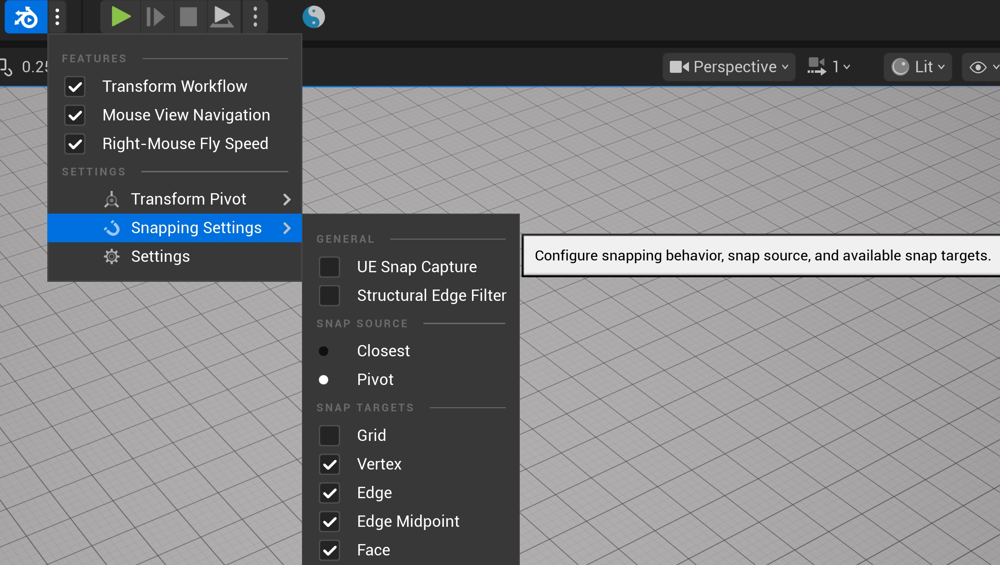
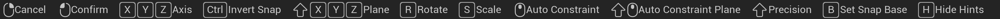
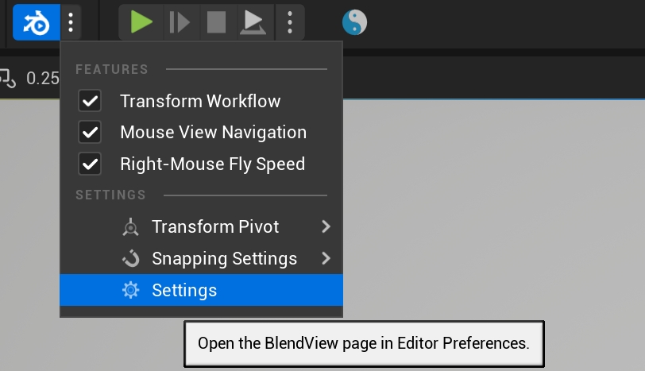
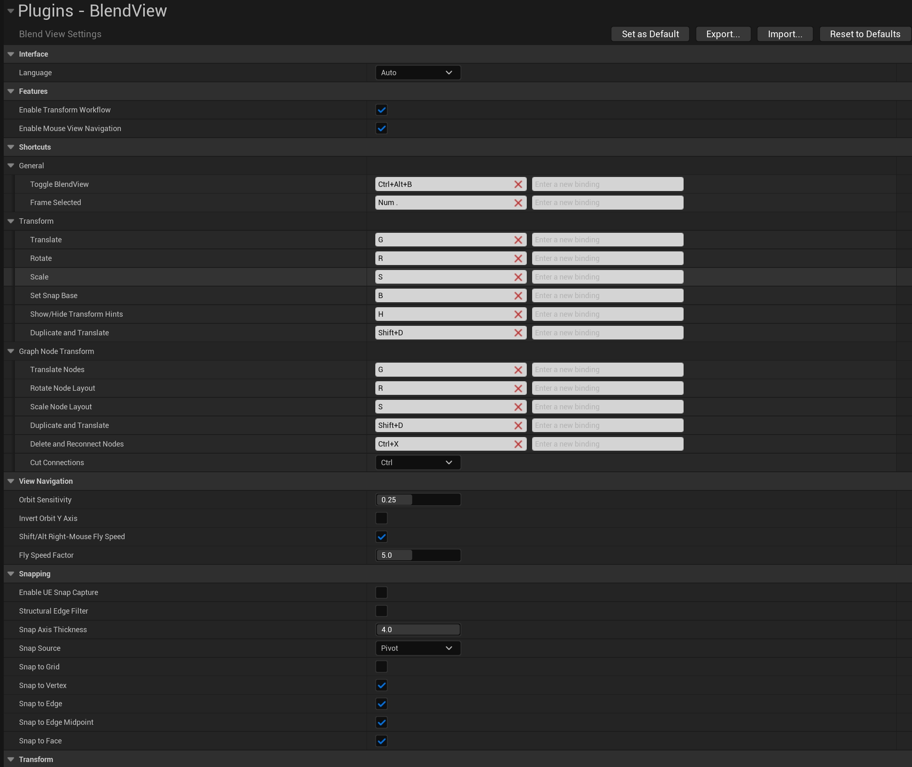


BlendView adds a Blender-style editing workflow to Unreal Editor: mouse viewport navigation, modal G/R/S transforms, temporary snapping, and graph node editing.

It is designed for users who frequently place level actors, adjust Blueprint components, align geometry, or organize Blueprint and Material graphs. BlendView only affects editor workflows and does not change game runtime behavior.

## Core Features

- **Mouse viewport navigation**: orbit, pan, and dolly views with middle mouse workflows.
- **G/R/S transforms**: move, rotate, and scale selected actors, components, or graph nodes with modal shortcuts.
- **Axis and plane constraints**: lock transforms to X/Y/Z axes or exclude one axis for planar transforms.
- **Temporary snapping**: hold `Ctrl` during transforms to snap to grids, vertices, edges, edge midpoints, or surfaces.
- **Snap base reset**: press `B` to choose the base point that should align to the snap target.
- **Duplicate and move**: press `Shift + D` to duplicate and immediately enter move mode.
- **Graph workflow**: move, rotate, scale, duplicate, preview, reconnect, and cut graph nodes with consistent shortcuts.

## Installation and Activation

1. Enable the `BlendView` plugin in Unreal Editor and restart the editor.
2. Find the BlendView icon in the top toolbar and make sure the main toggle is enabled.

## Mouse Viewport Navigation

- `MMB`: orbit the viewport.
- `Shift + MMB`: pan the viewport.
- `Ctrl + MMB`: dolly the viewport.

- `Alt + MMB`: align to the nearest axis direction and switch to an orthographic view.
- Hold `RMB` and use `W/A/S/D/Q/E`: fly through the viewport.
- Hold `Shift` during RMB flight: increase camera speed by the speed factor. Default: `5`.
- Hold `Alt` during RMB flight: decrease camera speed by the speed factor. Default: `5`.

Mouse navigation is available in supported editor scene viewports, including Level, Static Mesh preview, Skeletal Mesh preview, Animation preview, Blueprint preview, Component / Child Actor preview, and Material preview viewports.

## G/R/S Transforms

- `G`: move the selection.
- `R`: rotate the selection.
- `S`: scale the selection.
- `Shift + D`: duplicate the selection and enter move mode.
- `Alt + G`: reset location.
- `Alt + R`: reset rotation.
- `Alt + S`: reset scale.

When RMB viewport flight is active, BlendView automatically pauses G/R/S transform input so `W/A/S/D/Q/E` flight controls do not conflict with transform shortcuts such as `S`.

During a transform:

- `LMB` / `Enter` / `Space`: confirm the transform.
- `RMB` / `Esc`: cancel the transform and restore the previous state.
- `Shift`: fine adjustment.
- Numeric input: enter an exact move distance, rotation angle, or scale value. Translation units default to meters and can be changed to Unreal centimeters in the plugin settings. Tail minus input is supported, so `5-` is interpreted as `-5`.
- `Backspace`: delete the current numeric input.
- `H`: hide or show the bottom hint bar.
- Press `R` twice: trackball / free rotation.

### Axis and Plane Constraints

<video src="assets/videos/axis-plane-constraints.mp4" controls muted loop playsinline width="100%"></video>

- `X` / `Y` / `Z`: constrain to a single X, Y, or Z axis.
- Press `X` / `Y` / `Z` twice: switch between global and local axis constraints.
- `Shift + X/Y/Z`: exclude that axis and transform within the remaining two-axis plane.
- `MMB`: automatically choose the closest axis constraint.
- `Shift + MMB`: automatically choose a plane constraint.
- `C`: clear the active axis or plane constraint.

## Snapping

<video src="assets/videos/temporary-snap.mp4" controls muted loop playsinline width="100%"></video>

- Hold `Ctrl`: enable temporary snapping during a transform.

<video src="assets/videos/reset-snap-base.mp4" controls muted loop playsinline width="100%"></video>

- Press `B`: reset the snap base.

Typical workflow:

1. Press `G` to move an object.
2. Press `B` to choose a corner or reference point as the snap base.
3. Hold `Ctrl` to align that base point to another object's vertex, edge midpoint, or surface.

Move snapping supports:

- Grid.
- Vertex.
- Edge.
- Edge midpoint.
- Surface.

Temporary snapping also works with axis constraints, plane constraints, and supported orthographic views.

For rotation and scale, holding `Ctrl` uses Unreal Editor's current rotation / scale snap steps.

### Snap Settings

- **UE Snap Capture**: uses Unreal Editor's current grid, rotation, and scale snap settings for BlendView transforms.
- **Structural Edge Filter**: filters internal triangle edges on continuous surfaces, making edge snapping favor clear structural boundaries.
- **Snap base modes**: Closest / Pivot. Default: Pivot.
- **Snap targets**: Grid / Vertex / Edge / Edge midpoint / Surface.

Snap targets, snap base mode, and snap axis thickness can be adjusted in the plugin settings.

## Graph Operations

<video src="assets/videos/graph-transform.mp4" controls muted loop playsinline width="100%"></video>

- `G`: move graph nodes.
- `R`: rotate graph nodes.
- `S`: scale graph nodes.

<video src="assets/videos/graph-actions.mp4" controls muted loop playsinline width="100%"></video>

- `Ctrl + Shift + LMB`: click a Material node to preview it directly, without clicking the small node preview button.
- `Ctrl + X`: delete and reconnect nodes. Compared with Unreal's native `Shift + Delete`, this also supports Material nodes.
- `Shift + D`: duplicate nodes and enter move mode.

Graph shortcuts can be customized in BlendView settings. The graph connection cutting modifier can be changed to `Ctrl`, `Alt`, or `Shift`.

## Feedback and Interaction

BlendView provides Blender-style visual feedback during editing:

- Bottom hint bar: shows available actions for the current state.
- Top value bar: shows the current transform values.
- State cursor: shows different cursors for move, rotate, and scale states.
- Helper lines: show transform direction, constraint direction, and snap references.

## Settings and Customization

BlendView can be configured from the toolbar quick menu and the plugin settings page.

Configurable options include:

- Main plugin toggle.
- Mouse viewport navigation.
- RMB flight speed up with `Shift` / slow down with `Alt`.
- Flight speed factor.
- G/R/S transform shortcuts.
- `Shift + D` duplicate and move.
- `Alt + G/R/S` reset transform.
- Snap base shortcut.
- Snap target types.
- Snap base mode.
- Transform pivot mode.
- Snap axis thickness.
- Graph node operations.
- Graph connection cutting shortcut.
- Top / bottom hint display.
- Interface language.

## FAQ

### How do I quickly enable or disable BlendView?

Use the top toolbar button, or press the default shortcut `Ctrl + Alt + B`, to quickly enable or disable BlendView.

In most cases, you do not need to disable the plugin frequently. If a shortcut conflict occurs, first change the corresponding shortcut in `Editor Preferences > BlendView`, or adjust the related native Unreal command in Unreal's keyboard shortcut settings. Unused BlendView modules can also be disabled independently.

### How do I hide the bottom hint bar?

Press `H` while transforming or navigating to hide or show the bottom hint bar.

## Supported Areas

Mouse navigation supports:

- Level viewports.
- Static Mesh preview viewports.
- Skeletal Mesh preview viewports.
- Animation preview viewports.
- Blueprint preview viewports.
- Component / Child Actor preview viewports.
- Material preview viewports.

G/R/S transforms support:

- Actors in Level viewports.
- Components, Blueprint components, and Child Actor Components in Blueprint viewports.
- Scene components in supported asset editor viewports.
- Move, rotate, scale, and temporary snapping in supported orthographic views.

Graph operations support:

- Blueprint graphs.
- Construction Script graphs.
- Material graphs.
- Other parseable standard GraphEditor-based graphs.

## Disclaimer

BlendView is an independent Unreal Editor plugin and is not affiliated with, endorsed by, or sponsored by Blender Foundation or Epic Games.
