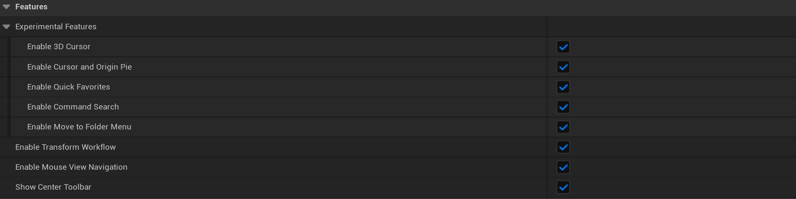
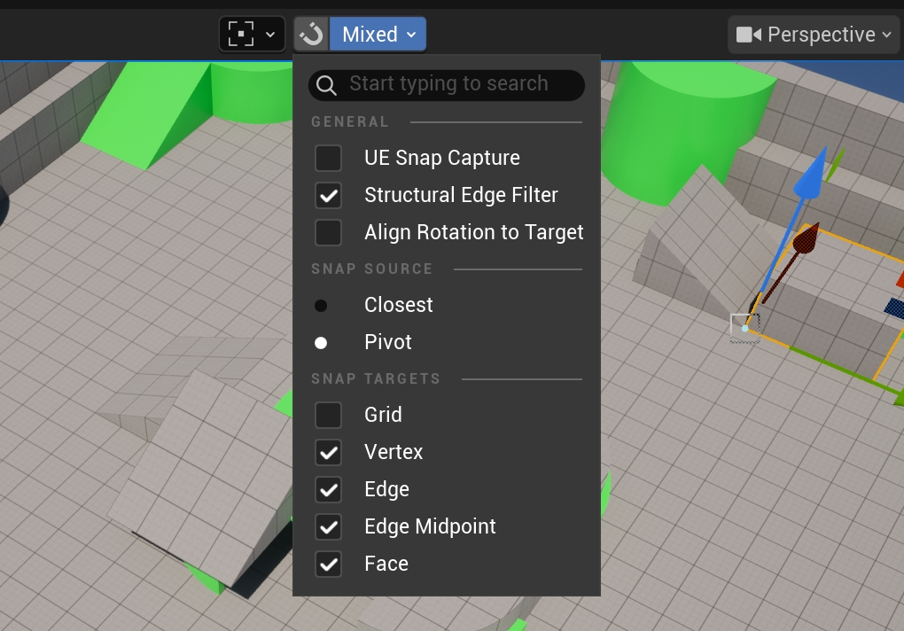
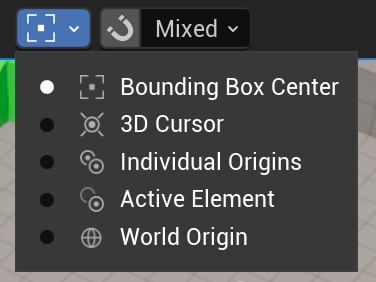
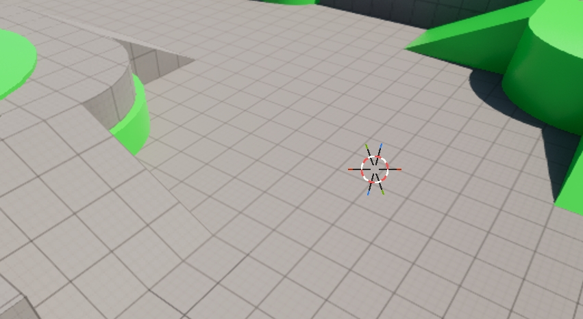
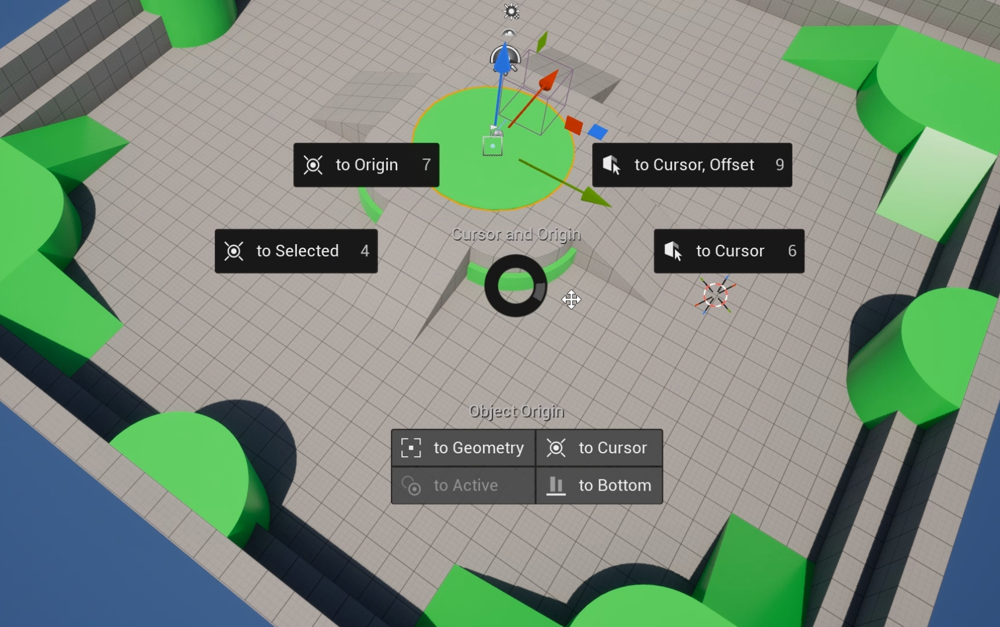
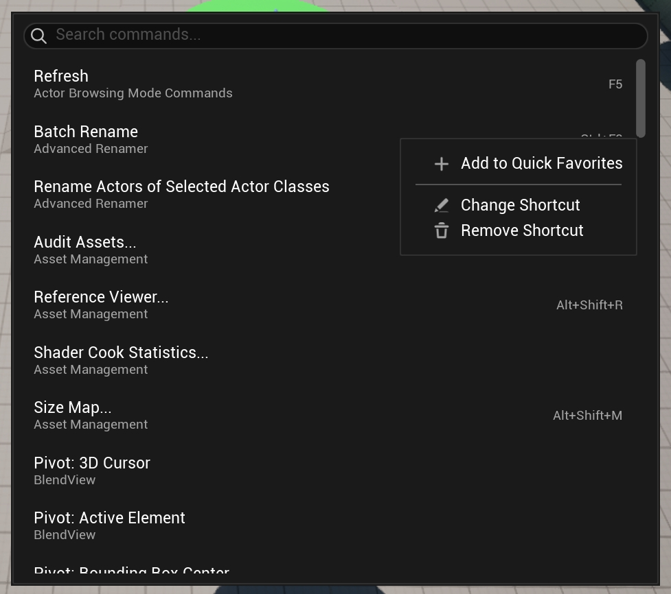
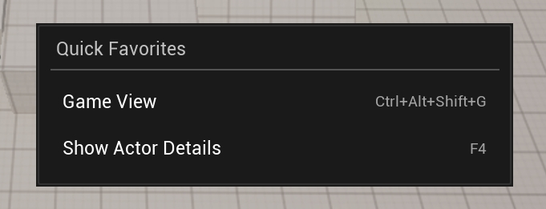
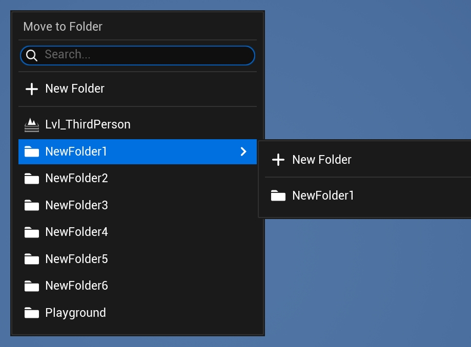

# BlendView User Guide

[English](index.md) | [简体中文](zh-CN.md)

## Quick Start

### Enable / Disable

Use the BlendView toolbar button to temporarily enable or disable the plugin.

You can also disable individual modules in the settings Feature group: navigation, G/R/S, snapping, center toolbar, 3D Cursor, pie menu, command search, quick favorites, Move to Folder, and graph tools.

## Viewport Navigation

Use Blender-style middle mouse navigation in UE scene viewports.

- `MMB`: orbit view.
- `Shift + MMB`: pan view.
- `Ctrl + MMB`: dolly / zoom view.

- `Alt + MMB`: align to the nearest axis view.
- Hold `Shift` during RMB flight: speed up.

To avoid conflicts with transform commands, BlendView blocks transform modules while RMB flight is active. This means `RMB + S` keeps working as backward flight instead of starting Scale.

## G/R/S Transform

- `G`: move.
- `R`: rotate.
- `S`: scale.
- `Shift + D`: duplicate, then move.
- `Alt + G/R/S`: reset location / rotation / scale.

G/R/S enters a temporary transform state. You can use optional subcommands, with a Blender-style bottom hint bar:

| Key | Function |
| --- | --- |
| `LMB`, `Enter`, `Space` | Confirm |
| `RMB`, `Esc` | Cancel |
| `Shift` | Precision mode, slower pointer movement |
| Number keys | Exact numeric value |
| `Backspace` | Delete numeric input |
| `X/Y/Z` | Axis constraint |
| `X/X`, `Y/Y`, `Z/Z` | Toggle global / local |
| `Shift + X/Y/Z` | Plane constraint |
| `MMB` | Pick nearest axis |
| `Shift + MMB` | Pick nearest plane |
| `C` | Clear constraint |
| `Ctrl` | Temporary snap |
| `B` | Reset snap base |
| `O` | Edit Actor pivot |
| `O/O` | Enter UE Edit Pivot mode |
| `H` | Show / hide bottom hint bar |
| `R/R` | Free rotation |

<video src="assets/videos/axis-plane-constraints.mp4" controls muted loop playsinline width="100%"></video>

- Press `G`, then `X`: move along X.
- Press `G`, then `Shift + Z`: move on the XY plane.
- Press `R`, then `Z`: rotate around Z.
- Press `S`, then `X`: scale on X.

## Snapping

<video src="assets/videos/temporary-snap.mp4" controls muted loop playsinline width="100%"></video>

Snapping aligns a source point on the selection to a target point in the scene.

- Hold `Ctrl` during `G`: enable temporary snap.

<video src="assets/videos/reset-snap-base.mp4" controls muted loop playsinline width="100%"></video>

- `B`: reset snap base.

## Center Toolbar

The top center toolbar provides quick access to snapping settings and transform pivot settings.

### Snapping Settings

**General:**

- **UE Snap Capture**: Uses UE native snap capture to assist BlendView snapping.
- **Structural Edge Filter**: Prioritizes structural edges and ignores points or lines that do not affect the structure.
- **Align Rotation to Target**: Rotates the object to align with the target surface or direction while snapping.

**Snap Source:**

- **Closest**: Uses the closest point on the selected object as the snap source.
- **Pivot**: Uses the object pivot as the snap source.

**Snap Targets:**

- **Grid**: Allows snapping to the viewport grid.
- **Vertex**: Allows snapping to mesh vertices.
- **Edge**: Allows snapping to mesh edges.
- **Edge Midpoint**: Allows snapping to edge midpoints.
- **Face**: Allows snapping to mesh surfaces.

### Transform Pivot

- **Bounding Box Center**: Uses the center of the selected objects' combined bounding box for rotate and scale.
- **3D Cursor**: Uses the 3D Cursor position as the transform center.
- **Individual Origins**: Each selected object rotates or scales around its own origin.
- **Active Element**: Uses the pivot of the last selected active element as the transform center.
- **World Origin**: Uses the world origin `(0, 0, 0)` as the transform center.

## Graph Editing

<video src="assets/videos/graph-transform.mp4" controls muted loop playsinline width="100%"></video>

Graph tools bring the same modal transform habit to Blueprint, Material, and other supported GraphEditor panels.

- `G/R/S`: move / rotate / scale graph nodes.
- `X/Y`: graph constraints.
- `Ctrl`: graph snapping where supported.

<video src="assets/videos/graph-actions.mp4" controls muted loop playsinline width="100%"></video>

- `Ctrl + Shift + LMB`: preview Material node.
- `Ctrl + X`: delete and reconnect where supported.
- `Shift + D`: duplicate and move.

## Experimental Features

Experimental features are modules that are still being polished. They are generally usable, but may only apply to specific editor contexts or may continue to receive interaction refinements.

### 3D Cursor

- `Shift + RMB`: place the cursor.

BlendView provides a Blender-style 3D Cursor: a temporary reference point that can be placed in the scene. It stores both location and rotation, and can be used as a transform center, object movement target, object origin target, or spatial reference for later alignment and editing.

### Cursor and Origin Pie Menu

- **Cursor and Origin pie menu** quickly moves the 3D Cursor, moves selected objects to the cursor, or adjusts object origins.
- **Open**: hold `Shift + S` to show the menu, then release `Shift` to close it.

**Cursor and Origin:**

- **to Origin**: Moves the 3D Cursor to the world origin and resets cursor rotation.
- **to Selected**: Moves the 3D Cursor to the current selection; with multiple objects, moves to the combined selection center.
- **to Cursor, Offset**: Moves the selected objects as a group to the 3D Cursor while preserving relative offsets.
- **to Cursor**: Moves the selected objects to the 3D Cursor and aligns to the cursor rotation.

**Object Origin:**

- **to Geometry**: Moves the Actor pivot to its geometry center.
- **to Cursor**: Moves the Actor pivot to the 3D Cursor position.
- **to Active**: Moves the Actor pivot to the active element pivot.
- **to Bottom**: Moves the Actor pivot to the bottom center of the object.

### Search

- `F3`: search commands.

BlendView provides a Blender-style `F3` command search. Type a keyword to find commands available in the current context, then left-click to execute. Right-click a command to add it to `Q` Quick Favorites; supported commands can also have shortcuts assigned or changed here.

### Quick Favorites

- `Q`: open favorites.

BlendView provides a Blender-style `Q` Quick Favorites menu for frequently used commands. Press `Q` and left-click a command to execute it. Commands can be added from the `F3` search menu or removed from the right-click menu.

### Move to Folder

- `M`: open the quick move menu.

Similar to Blender's `M` quick move menu, this moves the selected Actors to a World Outliner folder.

## Settings

Settings include module toggles, shortcuts, navigation, snapping, pivot modes, center toolbar, 3D Cursor, command search, quick favorites, graph tools, hint bars, language, and experimental features.

BlendView shortcuts take priority over native shortcuts. If Unreal has the same shortcut, BlendView will handle it first.
